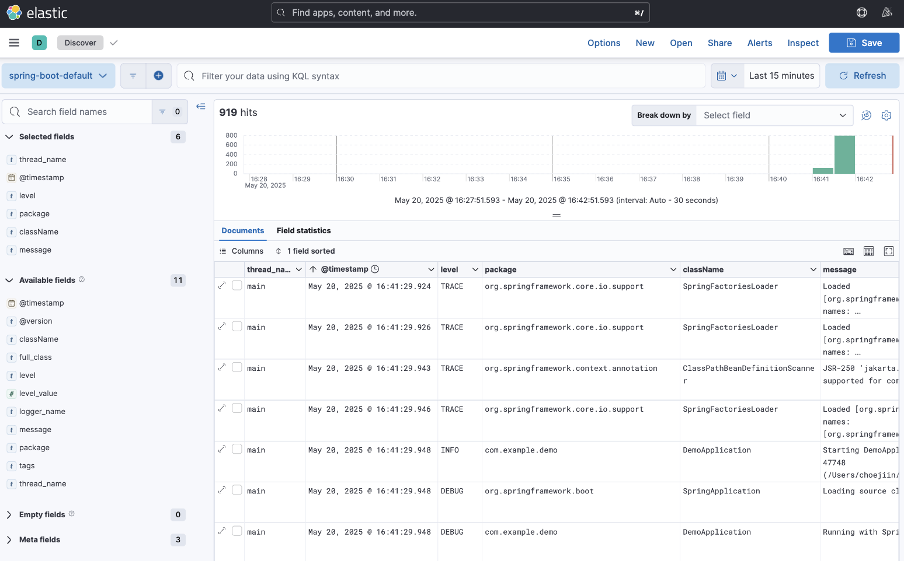

## Steps to configure ELK system with Docker

This configuration is for exploring Spring boot log. SSL/TLS encryption is not being used here.

### 1. Set password in .env

```bash
# Password for the 'elastic' user (at least 6 characters)
ELASTIC_PASSWORD=changeme

# Password for the 'kibana_system' user (at least 6 characters)
KIBANA_PASSWORD=changeme
```

### 2. Run Elastic Search

- Common docker network and volume configuration is written in `docker-compose.yml`.

```bash
docker compose -f docker-compose.elastic.yml -f docker-compose.yml up --build -d
```

- If Elastic Search is running, you can get response from `http://localhost:9200`.

### 3. Set up password for Kibana

```bash
docker compose -f docker-compose.setup.yml -f docker-compose.yml up --build -d
```

### 4. Run Kibana

```bash
docker compose -f docker-compose.kibana.yml -f docker-compose.yml up --build -d
```

- If Kibana is running, you can see Kibana UI in `http://localhost:9200`.

### 5. Configure Logstash and Run Logstash

- Configure input, output, filter(optional) in `logstash.conf` and then run Logstash.

```bash
docker compose -f docker-compose.logstash.yml -f docker-compose.yml up --build -d
```

## 6. View Logs in Kibana

- Move to **Management** > **Stack Management** > **Kibana** > [Data Views](http://localhost:5601/app/management/kibana/dataViews).
- Click the **[Create data view]** button and create data view with the index pattern that you wrote in `logstash.conf`.
- Move to **Analytics** > **Discover** and customize your fields and filters to explore your logs.

### Example (logs sended to Logstash from Spring boot by Logback)


